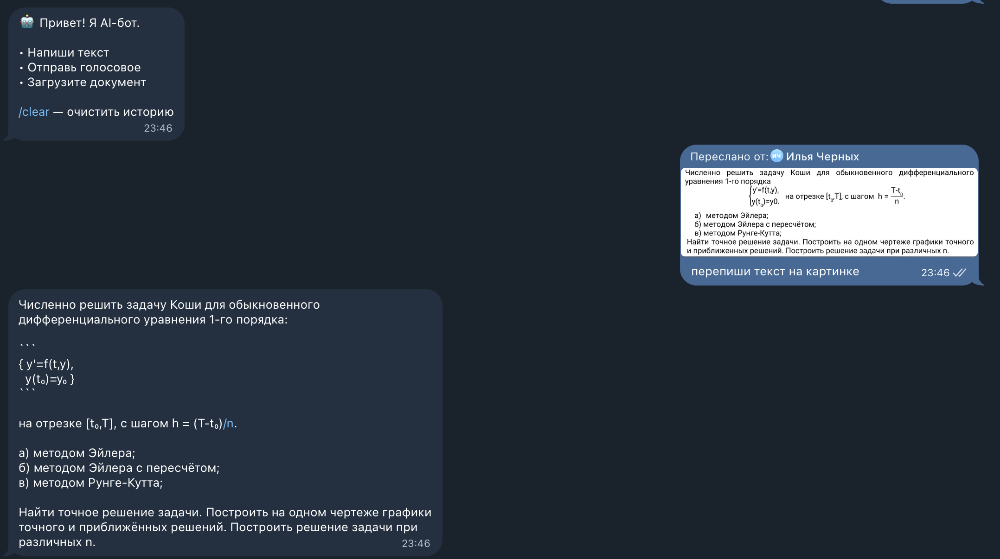
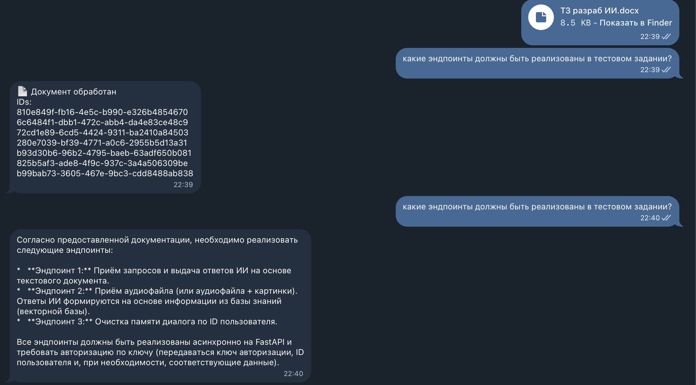
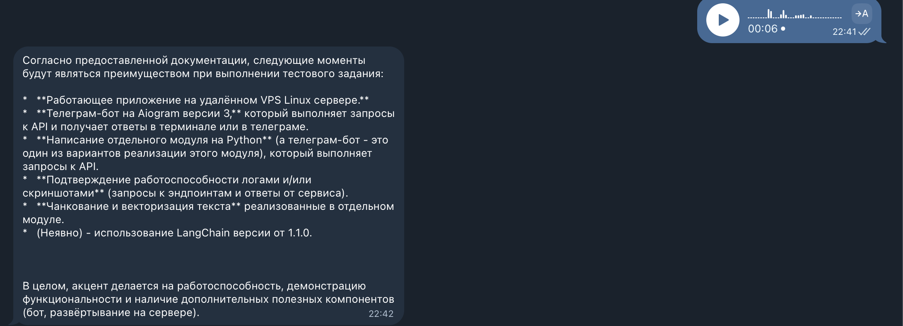

# Платформа

Эта платформа предоставляет AI-сервисы для образования, включая ASR (автоматическое распознавание речи) и LLM (крупномасштабные языковые модели).

## Архитектура

Платформа состоит из двух основных сервисов:

1. **Сервис ASR** - Обрабатывает преобразование аудио в текст с помощью Whisper
2. **Сервис LLM** - Предоставляет AI-ответы на вопросы с использованием базы знаний

## Сервисы

### Сервис ASR
- Преобразует аудио файлы в текст с использованием OpenAI Whisper
- Предоставляет аутентификацию с API-ключами
- Поддерживает множество форматов аудио и видео
- Автоматическое определение языка речи

### Сервис LLM
- AI-ответы на вопросы с использованием векторной базы знаний
- Поддерживает текстовые запросы с дополнительным контекстом изображения
- Поддерживает аудио запросы (преобразованные в текст через ASR) с дополнительным контекстом изображения
- Контекстно-зависимая память для разговоров
- Журналирование взаимодействий пользователей в PostgreSQL

## Требования

- Docker и Docker Compose
- API-ключ OpenAI или совместимый сервис

## Установка

1. Скопируйте `.env.example` в `.env` и настройте параметры:
   ```bash
   cp .env.example .env
   # Отредактируйте .env с вашими API-ключами и настройками
   ```

2. Запустите сервисы:
   ```bash
   make up
   ```

## Документация по API

- Сервис LLM: См. [llm/README.md](llm/README.md)
- Сервис ASR: См. [asr/README.md](asr/README.md)

## Используемые технологии

- FastAPI
- LangChain
- OpenAI API
- PostgreSQL с pgvector
- Docker
- Whisper (для ASR)

## Скрины





